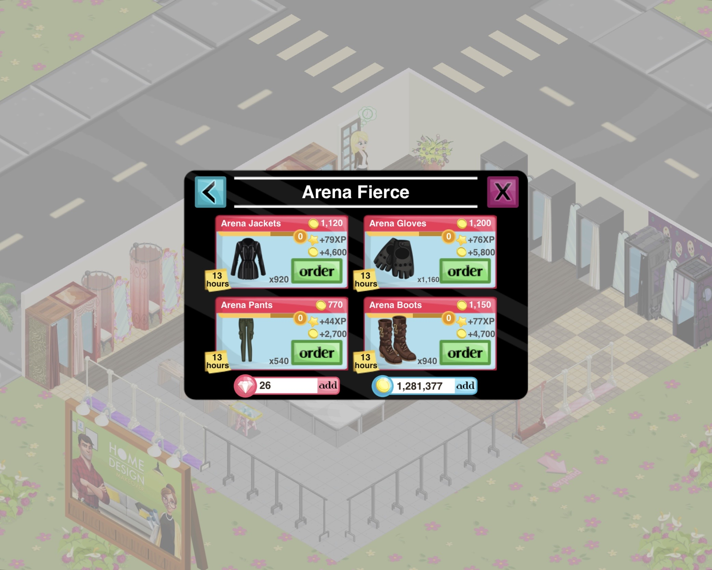

# Week 02 - Fashion story optimizer

## Anecdote
On my free time I sometimes open this videogame called *Fashion Story* - it is basically about owning a clothing store, which can be expanded and decorated as one likes, and selling hundreds of different outfits. Below is a small overview of specific collections in the game and the clothes one can choose in one of those collections:

 

There are over 20 slots where clothes can be placed for order - that means it sometimes gets boring to decide on which clothes I should order among this vast set of items.

## Overview
Since each outfit is more expensive than others but each also provides different profits and experience points (XP), I wanted to find, given my availability in a day, the combination of purchases that leads to the highest revenue (or XP).  

This mini-project consists of the following:
- A script to [read](src/data/read_data.py) the information about [shopping items](data/catalog_subset.csv).
- The initial [optimization algorithm](src/models/milp_solver.py). The mathematical modelling and the model's features will be described in the same folder.

In order to use this code, you can modify and run the [main.py](main.py) script. If you're working with *uv*, this can be simply done by running this:

```
uv run main.py
```

## Topics Covered
- Optimization. Scheduling problems.

## Notes
- 
